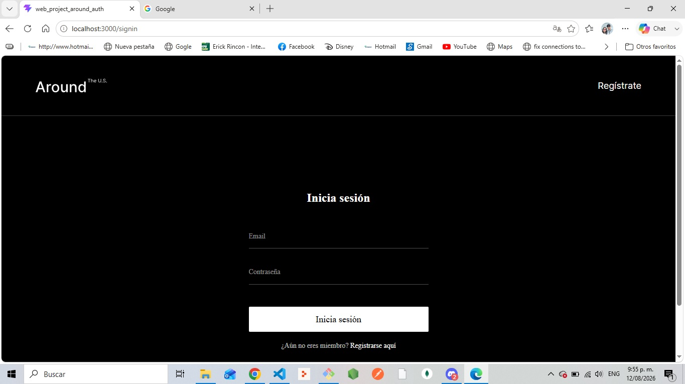
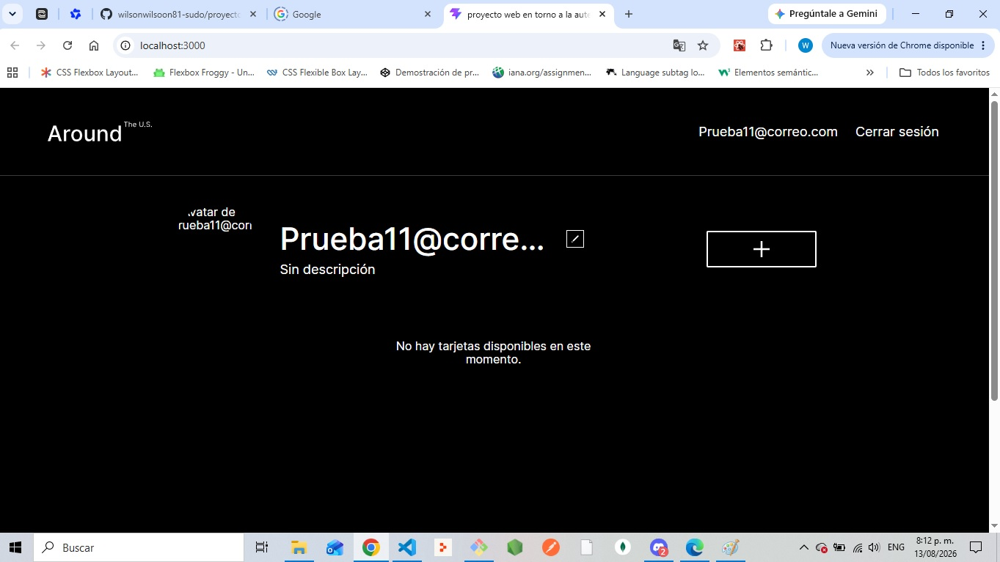
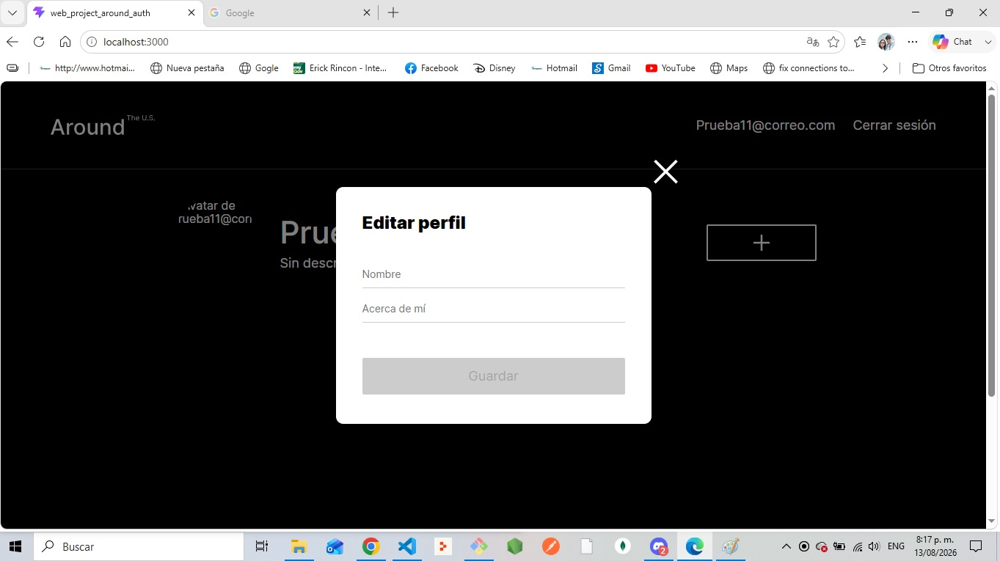
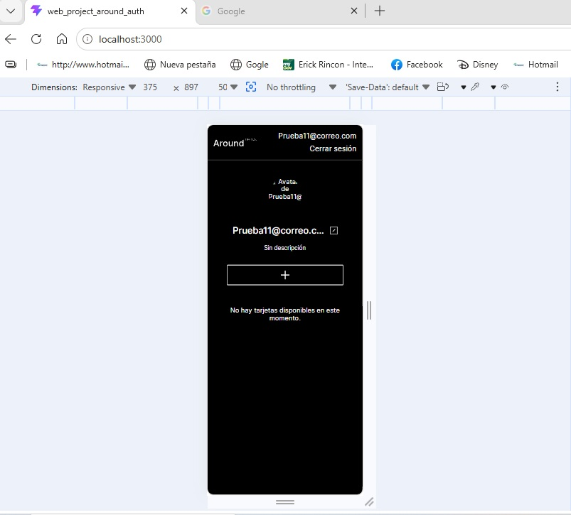

# Around (Alrededor de los EE.UU.) - Proyecto 18

Aplicación web de tarjetas interactivas con un sistema completo de autenticación de usuarios, desarrollada como parte del sprint 18 del programa de Desarrollo Web Frontend de Practicum.

## 🚀 Funcionalidades

- **Autenticación de usuarios**: Registro e inicio de sesión con validación de formularios.
- **Persistencia de sesión**: Uso de JWT (JSON Web Tokens) almacenados en `localStorage` para mantener la sesión activa al recargar la página.
- **Rutas protegidas**: Redirección automática a `/signin` si el usuario intenta acceder a rutas privadas sin un token válido.
- **Gestión de perfil**: Visualización y actualización de datos del usuario (nombre, descripción y avatar).
- **Gestión de tarjetas**: 
  - Visualización de tarjetas en una cuadrícula responsive.
  - Dar "Me gusta" (like) y quitar "Me gusta" a las tarjetas.
  - Eliminar tarjetas (solo las creadas por el usuario propietario).
  - Agregar nuevas tarjetas con validación de URL y nombre.
- **Interfaz de usuario**: Modales (popups) para edición de perfil, avatar, nuevas tarjetas y visualización de imágenes en tamaño completo.

## 🛠️ Tecnologías Utilizadas

- **React** (con Vite)
- **React Router DOM** (para el enrutamiento y protección de rutas)
- **CSS3** (Metodología BEM, diseño responsive con Media Queries)
- **Fetch API** (para las peticiones al backend)
- **JWT** (para la autenticación y autorización)

## 📦 Instalación y Ejecución

1. Clona este repositorio:
   ```bash
   git clone https://github.com/wilsonwilsoon81-sudo/web_project_around_auth.git
   ```

2. Navega a la carpeta del proyecto:
   ```bash
   cd web_project_around_auth
   ```

3. Instala las dependencias:
   ```bash
   npm install
   ```

4. Inicia el servidor de desarrollo:
   ```bash
   npm run dev
   ```
5. Abre tu navegador en http://localhost:3000 (o el puerto que indique la terminal).

## 📸 Capturas de Pantalla

### Pantalla de Inicio de Sesión


### Página Principal con Perfil


### Popup de Editar Perfil (Funcional)


### Diseño Responsive en Móvil


🔗 Enlace

Repositorio en GitHub: https://github.com/wilsonwilsoon81-sudo/web_project_around_auth.git

Desarrollado por Wilson Rolando Herrera Romero como parte del programa de Practicum.